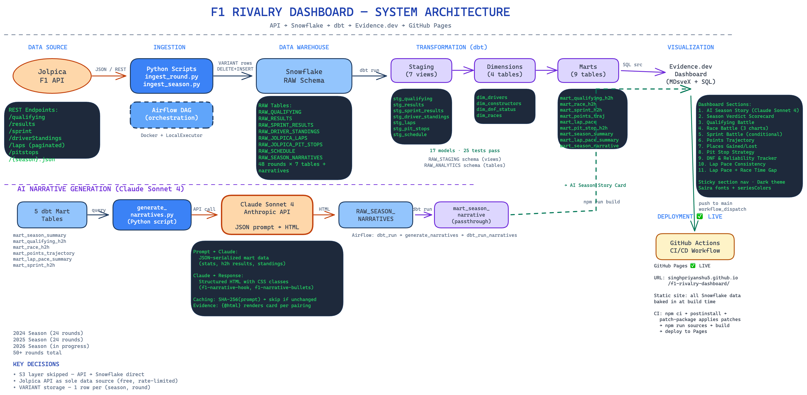

# F1 Teammate Rivalry Dashboard

An end-to-end data engineering project that visualizes Formula 1 teammate rivalries across qualifying, race results, sprint races, points progression, lap pace, and AI-generated season narratives — built with a modern analytics stack.

**Live Dashboard:** [singhpriyanshu5.github.io/f1-rivalry-dashboard](https://singhpriyanshu5.github.io/f1-rivalry-dashboard/)


## System Architecture



## Features

- **Season Verdict Scorecard** — At-a-glance summary: 7 color-coded verdict cards (Qualifying, Race H2H, Points, Reliability, Pit Stops, Sprint Race, Sprint Quali) with winner highlighted
- **Qualifying Battle** — Head-to-head qualifying wins and average gap (ms) per round
- **Race Battle** — Points swing, position gap scatter, cumulative H2H wins, and detailed race results
- **Sprint Battle** — Sprint race H2H wins, sprint points per round, and round-by-round detail table (conditionally shown only for sprint weekends)
- **Points Trajectory** — Season-long cumulative points for selected teammates (includes sprint race points)
- **Grid vs Finish — Places Gained** — Avg places gained, best recovery, grouped bar chart and cumulative line chart
- **Pit Stop Strategy Battle** — Avg pit duration, who gets pitted first, duration bar chart and pit lap timing scatter
- **DNF & Reliability Tracker** — Reliability %, mechanical DNFs, stacked bar chart by category, and DNF log table
- **Lap Pace Consistency** — IQR-based consistency score (0–100), pace window bar chart, and consistency trend line
- **Lap Pace Comparison** — Lap-by-lap overlay and total race time gap per round
- **AI Season Story** — LLM-generated rivalry narrative (qualifying, race, sprint, key moment, verdict) powered by Claude Sonnet 4, with prompt-hash caching to avoid redundant regeneration
- **Section Navigation** — Sticky color-coded pill bar for quick jumping between all 9 dashboard sections (Sprint pill shown conditionally)
- **Mid-Season Driver Swaps** — Cascading dropdowns let you select specific driver pairings (e.g. 2025 Red Bull: LAW vs VER for R01-R02, VER vs TSU for R03-R24)
- **Dark Telemetry UI** — Motorsport-inspired theme with Saira fonts, F1 team colors, and card-based layout

## Tech Stack

| Layer | Technology |
|-------|------------|
| **Data Source** | [Jolpica F1 API](https://github.com/jolpica/jolpica-f1) (qualifying, results, sprint results, standings, laps, pit stops, schedule) |
| **Orchestration** | Apache Airflow (Dockerized, LocalExecutor) |
| **Warehouse** | Snowflake (3 schema layers: RAW → STAGING → ANALYTICS) |
| **Transformation** | dbt Core (20 models, 22 tests) |
| **AI Narratives** | Claude Sonnet 4 via Anthropic API (prompt-hash cached) |
| **Dashboard** | [Evidence.dev](https://evidence.dev) (static site, Markdown + SQL) |
| **CI/CD** | GitHub Actions → GitHub Pages |

## Architecture

```
Jolpica API → Python Ingestion → Snowflake RAW (VARIANT)
                                      ↓
                                 dbt Staging (flatten + parse)
                                      ↓
                                 dbt Marts (H2H, trajectory, pace)
                                      ↓
                              Claude Sonnet 4 API → RAW_SEASON_NARRATIVES
                                      ↓
                                 Evidence.dev → GitHub Pages
```

**Key decisions:**
- S3 layer skipped — data flows API → Snowflake directly
- OpenF1 replaced with Jolpica (OpenF1 requires paid sponsorship since ~2025)
- API responses stored as single VARIANT array row per (season, round) for idempotent DELETE+INSERT

## Project Structure

```
f1-rivalry-dashboard/
├── airflow/                  # Airflow Docker setup + DAGs
│   ├── dags/
│   │   ├── f1_pipeline_dag.py
│   │   └── utils/            # Jolpica API client
│   ├── docker-compose.yml
│   └── Dockerfile
├── dbt/                      # dbt transformations
│   ├── models/
│   │   ├── staging/          # stg_qualifying, stg_results, stg_sprint_results, stg_laps, etc.
│   │   ├── dimensions/       # dim_drivers, dim_constructors, dim_races, dim_dnf_status
│   │   └── marts/            # mart_qualifying_h2h, mart_race_h2h, mart_sprint_h2h, mart_points_trajectory, mart_lap_pace, mart_pit_stop_h2h, mart_season_summary, mart_lap_pace_summary, mart_season_narrative
│   ├── seeds/                # dnf_status_mapping.csv
│   └── dbt_project.yml
├── evidence/                 # Evidence.dev dashboard
│   ├── pages/
│   │   ├── index.md          # Dashboard page (SQL + Svelte components)
│   │   └── +layout.svelte    # Custom dark theme layout
│   ├── sources/snowflake/    # Source SQL queries
│   ├── patches/              # patch-package fixes for Evidence components
│   └── evidence.config.yaml
├── scripts/                  # Standalone ingestion + generation scripts
│   ├── ingest_round.py       # Ingest single round: python ingest_round.py 2024 1
│   ├── ingest_season.py      # Ingest full season with rate limiting
│   ├── generate_narratives.py # Generate AI season narratives via Claude API
│   └── test_apis.py          # API connectivity test
├── sql/
│   └── snowflake_setup.sql   # DDL for raw tables
└── .github/workflows/
    └── deploy-evidence.yml   # CI/CD: build Evidence → deploy to GitHub Pages
```

## Setup

### Prerequisites

- Python 3.9+
- Node.js 18+
- Docker & Docker Compose (for Airflow)
- Snowflake account
- dbt Core (`pip install dbt-snowflake`)
- Anthropic API key (for AI narratives — optional, dashboard works without it)

### 1. Clone & Configure

```bash
git clone https://github.com/singhpriyanshu5/f1-rivalry-dashboard.git
cd f1-rivalry-dashboard
cp .env.example .env
# Fill in Snowflake credentials + ANTHROPIC_API_KEY in .env
```

### 2. Snowflake Setup

```bash
# Run the DDL to create database, schemas, and raw tables
# Execute sql/snowflake_setup.sql in your Snowflake worksheet
```

### 3. Ingest Data

```bash
pip install snowflake-connector-python requests pandas python-dotenv

# Single round
python scripts/ingest_round.py 2024 1

# Full season (sequential with rate limiting)
python scripts/ingest_season.py 2024
```

> **Note:** Jolpica rate-limits at ~30 req/min. The season script handles this with 2s delays between rounds.

### 4. Run Airflow (Orchestration)

```bash
cd airflow
docker compose up -d
# Airflow UI at localhost:8081 (admin/admin)
```

The `f1_pipeline_dag` runs on a schedule (`0 2 * * 0,1` — Sunday + Monday 2am UTC) and auto-detects the current season and latest round. It short-circuits on non-race weekends to avoid wasted API calls.

**Backfill mode:** Trigger manually via Airflow UI with params:
```json
{"mode": "backfill", "season": 2024, "start_round": 1, "end_round": 24}
```

Pipeline: `detect_rounds → ingest_rounds → dbt_run → generate_narratives → trigger_evidence_build`

### 5. Run dbt

```bash
cd dbt
dbt deps
dbt seed        # Load dnf_status_mapping.csv
dbt run         # Build 20 models
dbt test        # Run 22 tests
```

### 6. Generate AI Narratives (optional)

```bash
pip install anthropic
python scripts/generate_narratives.py              # all pairings
python scripts/generate_narratives.py --season 2024  # single season
python scripts/generate_narratives.py --force        # regenerate even if cached
```

Queries mart data, builds a structured prompt, calls Claude Sonnet 4, and stores the HTML narrative in `RAW_SEASON_NARRATIVES`. Uses prompt-hash caching — only regenerates when underlying data or the prompt template changes.

Then refresh the narrative mart:
```bash
cd dbt && dbt run --select mart_season_narrative
```

### 7. Run Evidence Dashboard (local)

```bash
cd evidence
npm install          # postinstall runs patch-package automatically
npm run sources      # Fetch data from Snowflake
npm run dev          # Dev server at localhost:3000
```

### 8. Build & Deploy

Pushing to `main` triggers the GitHub Actions workflow which builds Evidence and deploys to GitHub Pages.

```bash
# Or build locally
cd evidence
npm run build        # Static output in evidence/build/
```

**Required GitHub repo secrets for CI/CD:**
- `EVIDENCE_SOURCE__snowflake__account`
- `EVIDENCE_SOURCE__snowflake__username`
- `EVIDENCE_SOURCE__snowflake__password`

## Data Coverage

| Season | Rounds | Status |
|--------|--------|--------|
| 2024 | 1–24 | Fully loaded |
| 2025 | 1–24 | Fully loaded |
| 2026 | 1–2 | In progress (via Airflow DAG) |

## dbt Model Lineage

```
RAW_QUALIFYING ──→ stg_qualifying ──→ mart_qualifying_h2h ──→ mart_season_summary
RAW_RESULTS ────→ stg_results ─────→ mart_race_h2h ─────────→ mart_season_summary
RAW_SPRINT_RESULTS → stg_sprint_results → mart_sprint_h2h ──→ mart_season_summary
RAW_DRIVER_STANDINGS → stg_driver_standings → mart_points_trajectory
RAW_JOLPICA_LAPS ──→ stg_laps ────→ mart_lap_pace ──→ mart_lap_pace_summary
RAW_JOLPICA_PIT_STOPS → stg_pit_stops → mart_pit_stop_h2h ──→ mart_season_summary
RAW_SCHEDULE ───→ stg_schedule ──→ dim_races ──→ (all marts)
                                    dim_drivers
                                    dim_constructors
seeds/dnf_status_mapping.csv ─────→ dim_dnf_status ──→ mart_race_h2h, mart_sprint_h2h
RAW_SEASON_NARRATIVES ──────────→ mart_season_narrative (Claude Sonnet 4 → prompt-hash cached)
```

## License

MIT
